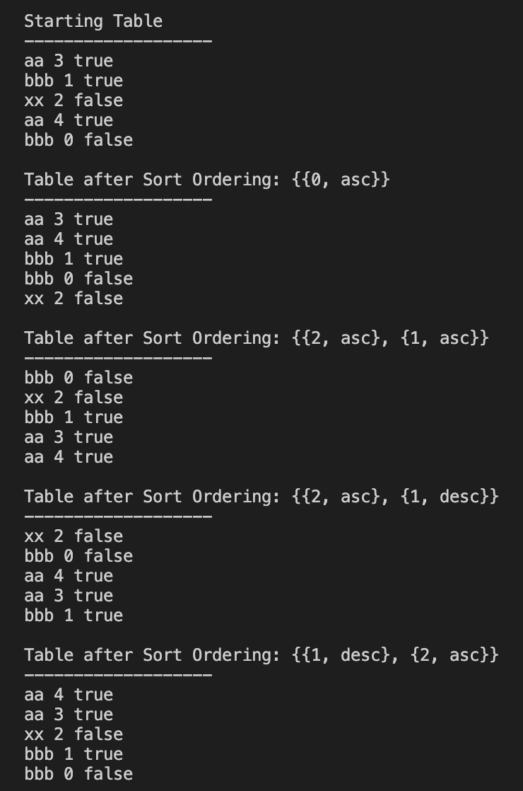

# Mini Database Table
A basic representation of a table in a database with that can represent a variable amount of rows, column types and rows with the ability to sort of a variable list of sort policies. Written in such a generic way as possible as to not narrow the possibilities in the future with new data types and abilities on the table.

Written using C++20 including concepts and built on top of bazel. To run yourself, clone repo and run "bazel run main"

Things to look for:
- Modern C++ Usage (Concepts, Named Types, Templates, Move Semantics...)
- General code organization (Ease of use, extensibility...)
- Leverage of the STL (All of the sorting is based on letting std::sort do all the work)
- Brevity / Cleanliness / Simplicity (This could very easy balloon up into something a lot more complicated)
