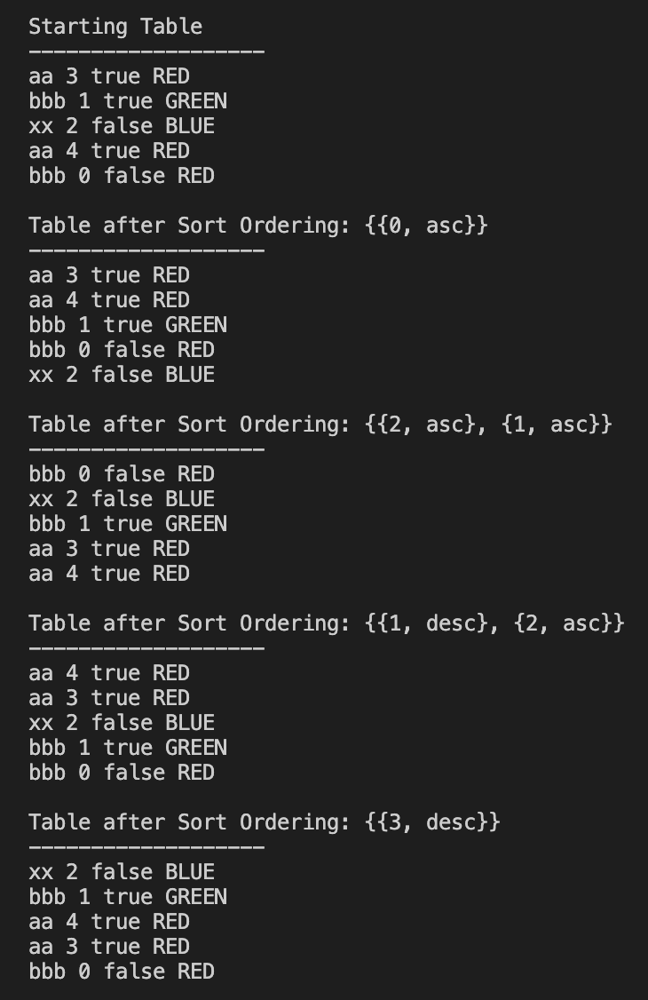

# Mini Database Table
Hint: All the fun logic is in the table folder (table/table.h)

Written using C++20 and built on top of bazel. To run yourself, clone repo and run "bazel run src/main"

A basic representation of a table in a database with that can represent a variable amount of rows, column types and rows with the ability to sort of a variable list of sort policies. Written in such a generic way as possible as to not narrow the possibilities in the future with new data types and abilities on the table.

COMING SOON: A Command Line Tool to play with making and sorting tables

Things to look for:
- Modern C++ Usage 
    - Concepts, Named Types, Templates, Move Semantics, Weak Ordering
    - Different types of containers can be passed in and all have the same result
- General code organization (Ease of use, extensibility...)
    - How easy it is to add a new type (Look at generic/color.h)
- Auto generation of database actions in the CLI with python (cli/generate/main.py)
- Leverage of the STL (All of the sorting is based on letting std::sort do all the work)
- Brevity / Cleanliness / Simplicity (This could very easy balloon up into something a lot more complicated)

Note: Some things were done because "they could be done" and to show off a little. This code is not necessarily the simplest and most beginniner friendly code possible
